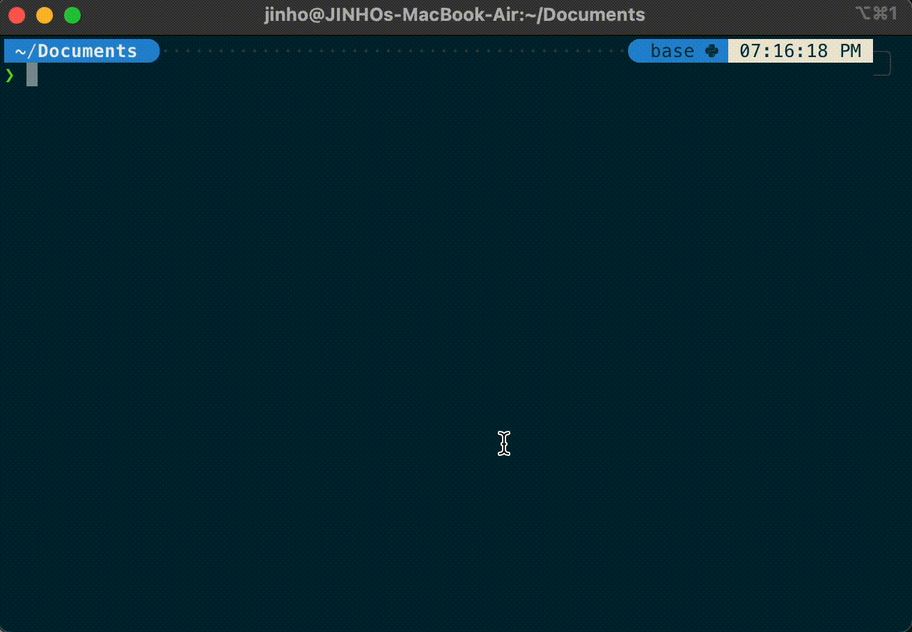

## ***POSCO AI·Big Data ACADEMY*** 16기 B반 알고리즘 스터디 리포지토리입니다 ❤️


주차별로 새로이 올라오는 문제를 풀고 코드를 commit 해주세요!
집단지성으로 발전하는 B반이 됩시다 🤙🏻


--------
### 초기 설정 방법
## <span style="color:orange"> 1. Fork </span>
   동아리장이 만든 리포지토리를 Fork해서 본인 리포지토리에 가져옵니다.
   [알고리즘 스터디 리포지토리 링크](https://github.com/seonghoon93/_AI16B_Algorithm_Study)
    
> Fork 후 생성되는 HTTPS 링크를 복사해두세요.


## <span style="color:orange"> 2. Clone </span>
실제로 문제를 풀 환경(컴퓨터)에서 git clone을 통해 스터디 리포지토리를 가져옵니다.


``` python
git clone <1에서 복사한 링크>  # 리포지토리 복사
cd _AI16B_Algorithm_Study # 복사한 리포지토리로 이동
```


## <span style="color:orange"> 3. Branch </span>
코드 작성은 새로운 브랜치에서 해주세요. 
브랜치명은 **본인이름**으로 하면 되겠습니다. 


``` python
git branch <이름> # <이름> 브랜치 생성
git checkout <이름> # <이름> 브랜치로 이동

# Tip
git status # 현재 브랜치 확인 가능 (맨 윗줄)
```


## <span style="color:orange"> 4. Commit & Push </span>
본인 브랜치에 코드를 업로드하고 commit & push를 통해 gitHub에 올립니다.


``` python
git add . # 깃으로 관리할 파일을 지정 (.(점)은 모든 파일 선택을 의미)
git commit -m "커밋 메시지 입력"
git push origin <이름> # <이름> 브랜치로 업로드
```


## <span style="color:orange"> 5. Pull Request </span>
4에서 업로드한 코드를 스터디장 보내기 위해(Master 브랜치에서 Merge하기 위해) Request 전송


>🚨 Conflict(충돌)이 발생했다는 알림이 뜨면 스터디장에게 말해주세요.